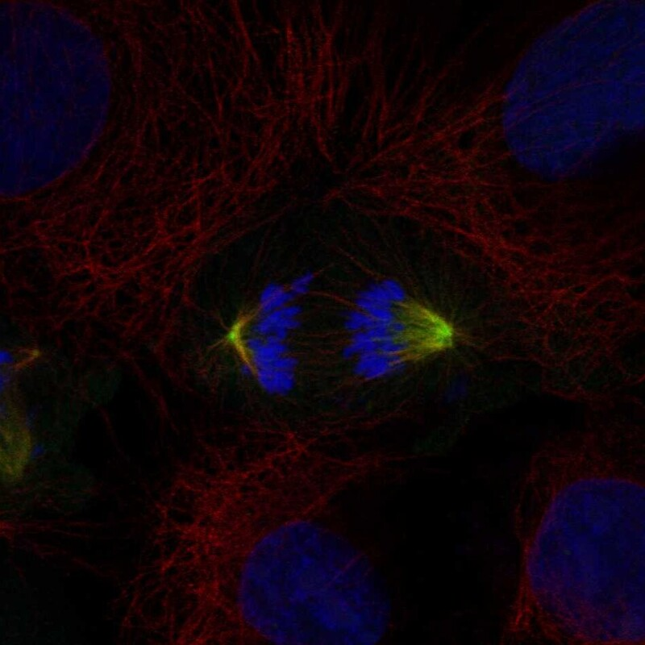

# AURKA — 中心体模块评估

## 1. 基本信息
- **UniProt:** O14965
- **蛋白名称:** Aurora kinase A (AURKA)
- **别名:** AIK, ARK1, AURA, BTAK, STK15, STK6
- **长度:** 403
- **HPA 来源:** 中心体

## 2. HPA 中心体 / 中心粒卫星证据

- **HPA 来源:** 中心体 ✓
- **IF 图像:** 已获取

## 3. UniProt / GO-CC 中心体证据

- **AlphaFold pLDDT:** High (kinase domain well-folded)
- **PAE:** Available
- **PDB:** 100+ structures (1MQ4, 3E5A, 5LX9)
- **InterPro:** IPR000719 Protein kinase, IPR008271 Ser/Thr kinase, IPR030616 Aurora kinase
- **Domain notes:** N-terminal regulatory (~130 aa) + C-terminal kinase domain

## 4. PubMed 文献证据

PubMed 总数: 3081 篇 ⚠️ **超过阈值 (>100)**

## 5. AlphaFold / PAE / PDB / 结构域

- **AlphaFold pLDDT:** High (kinase domain well-folded)
- **PAE:** Available
- **PDB:** 100+ structures (1MQ4, 3E5A, 5LX9)
- **InterPro:** IPR000719 Protein kinase, IPR008271 Ser/Thr kinase, IPR030616 Aurora kinase
- **Domain notes:** N-terminal regulatory (~130 aa) + C-terminal kinase domain

PAE 图像暂无数据（未生成本地图片或未可靠获取），结构判断基于 AlphaFold pLDDT 统计。

## 6. PPI / 蛋白互作网络

- **STRING:** Rich network (TPX2, BORA, CEP192, PLK1, INCENP, NEDD1)
- **IntAct:** 100+ interactions
- **BioGRID:** Extensive
- **Key centrosome interactors:** TPX2, CEP192, NEDD1, PLK1, BORA

## 7. 中心体模块评分表

| 维度 | 评分 | 依据 |
|---|---:|---|
| 中心体证据 | 20/20 | HPA 中心体 标注 |
| PubMed/文献 | 5/20 | 3081 篇文献 |
| PPI/互作网络 | 20/20 | 互作数据 |
| 结构/结构域 | 10/10 | 结构评估 |
| 新颖性/特异性 | 2/10 | 研究新颖性 |

- **最终评分:** **71/100**

## 8. 最终结论

**CENTROSOME ELIMINATED**

PubMed > 100 自动淘汰。

## 9. 人工复核备注
- HPA 来源: 中心体
- Pilot 报告规范化: 已转为中文五维评分，移除 TE 模块
