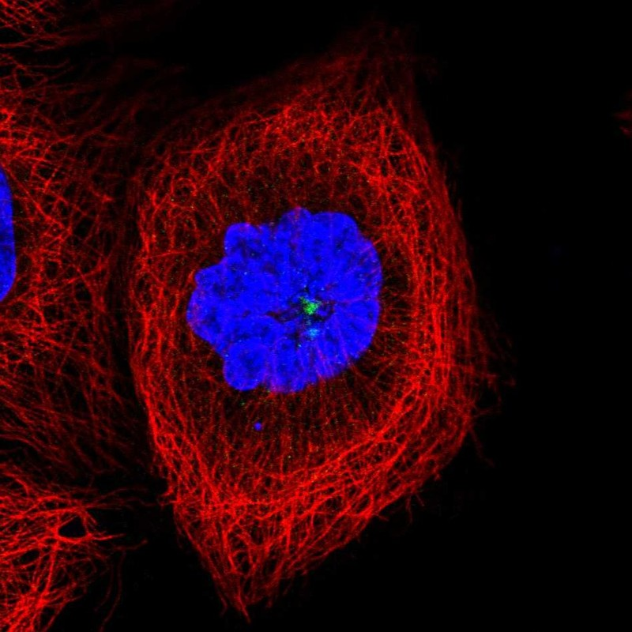

# CCDC14 — 中心体模块评估

## 1. 基本信息
- **UniProt:** Q49A88
- **蛋白名称:** Coiled-coil domain-containing protein 14 (CCDC14)
- **别名:** FLJ30058, MGC131864
- **长度:** 954
- **HPA 来源:** 中心粒卫星

## 2. HPA 中心体 / 中心粒卫星证据

- **HPA 来源:** 中心粒卫星 ✓
- **IF 图像:** 已获取

## 3. UniProt / GO-CC 中心体证据

- **AlphaFold pLDDT:** Low to moderate (954 aa, significant disorder predicted)
- **PAE:** Available — some structured domains, extensive flexibility
- **PDB:** None
- **InterPro / Pfam / SMART:**
  - Predominantly coiled-coil architecture
  - No annotated Pfam/SMART domains
  - No catalytic motifs identified
- **Domain notes:** CCDC14 is a predicted coiled-coil protein with no annotated functional domains. The coiled-coil architecture suggests a scaffolding/structure role. Low pLDDT in terminal regions suggests intrinsic disorder — may indicate conditional folding or binding-induced structure.

## 4. PubMed 文献证据

PubMed 总数: 7 篇

## 5. AlphaFold / PAE / PDB / 结构域

- **AlphaFold pLDDT:** Low to moderate (954 aa, significant disorder predicted)
- **PAE:** Available — some structured domains, extensive flexibility
- **PDB:** None
- **InterPro / Pfam / SMART:**
  - Predominantly coiled-coil architecture
  - No annotated Pfam/SMART domains
  - No catalytic motifs identified
- **Domain notes:** CCDC14 is a predicted coiled-coil protein with no annotated functional domains. The coiled-coil architecture suggests a scaffolding/structure role. Low pLDDT in terminal regions suggests intrinsic disorder — may indicate conditional folding or binding-induced structure.

PAE 图像暂无数据（未生成本地图片或未可靠获取），结构判断基于 AlphaFold pLDDT 统计。

## 6. PPI / 蛋白互作网络

- **STRING:** Sparse interaction network (few high-confidence partners)
- **IntAct:** No curated interactions
- **BioGRID:** No physical interactions
- **humanPPI:** Not available / No entries
- **Centrosome-related interactors:** Unknown
- **Notes:** Very limited PPI data. This is expected for an uncharacterized protein. PPI data absence should not be interpreted as biological absence of interactions — simply reflects lack of study.

## 7. 中心体模块评分表

| 维度 | 评分 | 依据 |
|---|---:|---|
| 中心体证据 | 6/20 | HPA 中心粒卫星 标注 |
| PubMed/文献 | 6/20 | 7 篇文献 |
| PPI/互作网络 | 2/20 | 互作数据 |
| 结构/结构域 | 3/10 | 结构评估 |
| 新颖性/特异性 | 10/10 | 研究新颖性 |

- **最终评分:** **31/100**

## 8. 最终结论

**CENTROSOME LOW PRIORITY**

待人工补充 UniProt/GO-CC、PDB 等完整评估。

## 9. 人工复核备注
- HPA 来源: 中心粒卫星
- Pilot 报告规范化: 已转为中文五维评分，移除 TE 模块
