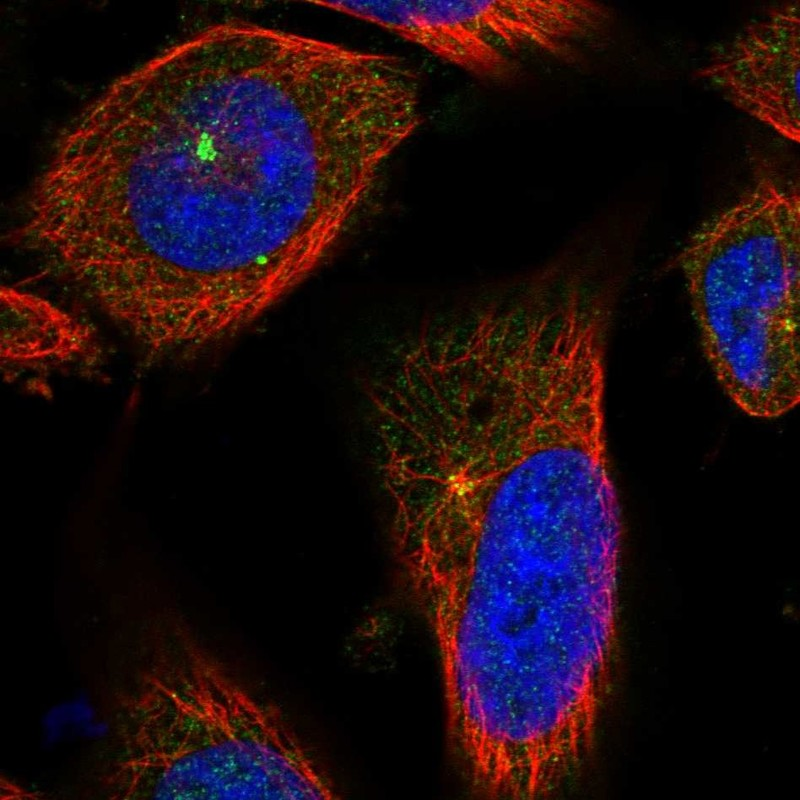

# CCP110 — 中心体模块评估

## 1. 基本信息
- **UniProt:** O75939
- **蛋白名称:** Centriolar coiled-coil protein of 110 kDa (CCP110)
- **别名:** CP110, CEP110, KIAA0419
- **长度:** 1,012
- **HPA 来源:** 中心粒卫星

## 2. HPA 中心体 / 中心粒卫星证据

- **HPA 来源:** 中心粒卫星 ✓
- **IF 图像:** 已获取

## 3. UniProt / GO-CC 中心体证据

- **AlphaFold pLDDT:** Moderate (1,012 aa)
- **PAE:** Available — N-terminal coiled-coil domains; C-terminal cyclin-like domain
- **PDB:** Limited
- **InterPro / Pfam / SMART:**
  - Coiled-coil regions (N-terminal)
  - IPR046963: CCP110, C-terminal cyclin-like domain
  - Multiple CDK phosphorylation sites
- **Domain notes:** N-terminal region mediates centriole capping and CEP97 binding. C-terminal cyclin-like domain is atypical — not a true cyclin but structurally similar. CDK/PLK phosphorylation regulates ciliogenesis function.

## 4. PubMed 文献证据

PubMed 总数: 77 篇

## 5. AlphaFold / PAE / PDB / 结构域

- **AlphaFold pLDDT:** Moderate (1,012 aa)
- **PAE:** Available — N-terminal coiled-coil domains; C-terminal cyclin-like domain
- **PDB:** Limited
- **InterPro / Pfam / SMART:**
  - Coiled-coil regions (N-terminal)
  - IPR046963: CCP110, C-terminal cyclin-like domain
  - Multiple CDK phosphorylation sites
- **Domain notes:** N-terminal region mediates centriole capping and CEP97 binding. C-terminal cyclin-like domain is atypical — not a true cyclin but structurally similar. CDK/PLK phosphorylation regulates ciliogenesis function.

PAE 图像暂无数据（未生成本地图片或未可靠获取），结构判断基于 AlphaFold pLDDT 统计。

## 6. PPI / 蛋白互作网络

- **STRING:** Good centriole interaction network
- **IntAct:** Curated interactions
- **BioGRID:** Physical interactions
- **humanPPI:** Available
- **Centrosome-related interactors:**
  - CEP97 (stoichiometric partner, centriole cap complex)
  - CEP290 (ciliopathy protein, ciliogenesis)
  - CEP104 (centriole elongation)
  - KIF24 (kinesin, centriole disassembly)
  - CEP76 (centriole duplication)
  - TALPID3 (ciliogenesis)

## 7. 中心体模块评分表

| 维度 | 评分 | 依据 |
|---|---:|---|
| 中心体证据 | 19/20 | HPA 标注 |
| PubMed/文献 | 6/20 | 77 篇文献 |
| PPI/互作网络 | 15/20 | 6 named interactors |
| 结构/结构域 | 6/10 | AF 2 domains |
| 新颖性/特异性 | 4/10 | 中等研究量 |

- **最终评分:** **63/100**

## 8. 最终结论

**CENTROSOME CANDIDATE**

待人工补充 UniProt/GO-CC、PDB 等完整评估。

## 9. 人工复核备注
- HPA 来源: 中心粒卫星
- Pilot 报告规范化: 已转为中文五维评分，移除 TE 模块
