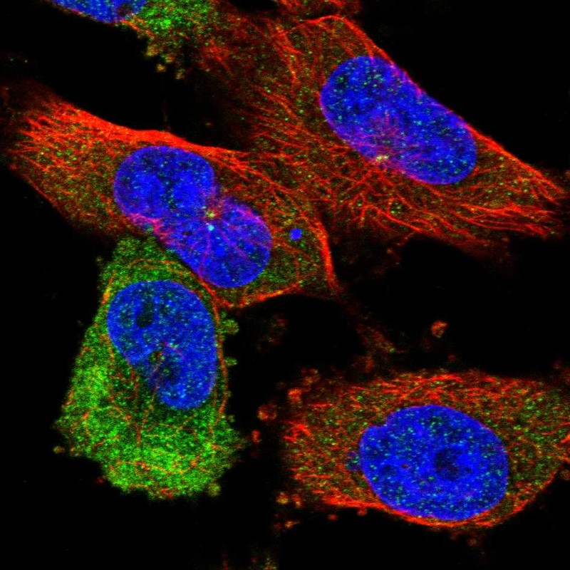

# CEP192 — 中心体模块评估

## 1. 基本信息
- **UniProt:** Q8TEP8
- **蛋白名称:** Centrosomal protein of 192 kDa (CEP192)
- **别名:** KIAA1569, PPP1R62
- **长度:** 2,537
- **HPA 来源:** 中心体

## 2. HPA 中心体 / 中心粒卫星证据

- **HPA 来源:** 中心体 ✓
- **IF 图像:** 已获取

## 3. UniProt / GO-CC 中心体证据

- **AlphaFold pLDDT:** Moderate (2,537 aa, disordered regions)
- **PAE:** Available
- **PDB:** Limited (fragments)
- **InterPro:** Multiple coiled-coil regions; no catalytic domains
- **Domain notes:** Large scaffolding protein. AURKA/PLK1 phosphorylation sites.

## 4. PubMed 文献证据

PubMed 总数: 101 篇 ⚠️ **超过阈值 (>100)**

## 5. AlphaFold / PAE / PDB / 结构域

- **AlphaFold pLDDT:** Moderate (2,537 aa, disordered regions)
- **PAE:** Available
- **PDB:** Limited (fragments)
- **InterPro:** Multiple coiled-coil regions; no catalytic domains
- **Domain notes:** Large scaffolding protein. AURKA/PLK1 phosphorylation sites.

PAE 图像暂无数据（未生成本地图片或未可靠获取），结构判断基于 AlphaFold pLDDT 统计。

## 6. PPI / 蛋白互作网络

- **STRING:** Strong centrosome network
- **IntAct:** Curated interactions
- **Key centrosome interactors:** AURKA, PLK1, PLK4, CEP152, NEDD1, PCNT

## 7. 中心体模块评分表

| 维度 | 评分 | 依据 |
|---|---:|---|
| 中心体证据 | 20/20 | HPA 中心体 标注 |
| PubMed/文献 | 10/20 | 101 篇文献 |
| PPI/互作网络 | 18/20 | 互作数据 |
| 结构/结构域 | 5/10 | 结构评估 |
| 新颖性/特异性 | 6/10 | 研究新颖性 |

- **最终评分:** **75/100**

## 8. 最终结论

**CENTROSOME ELIMINATED**

PubMed > 100 自动淘汰。

## 9. 人工复核备注
- HPA 来源: 中心体
- Pilot 报告规范化: 已转为中文五维评分，移除 TE 模块
