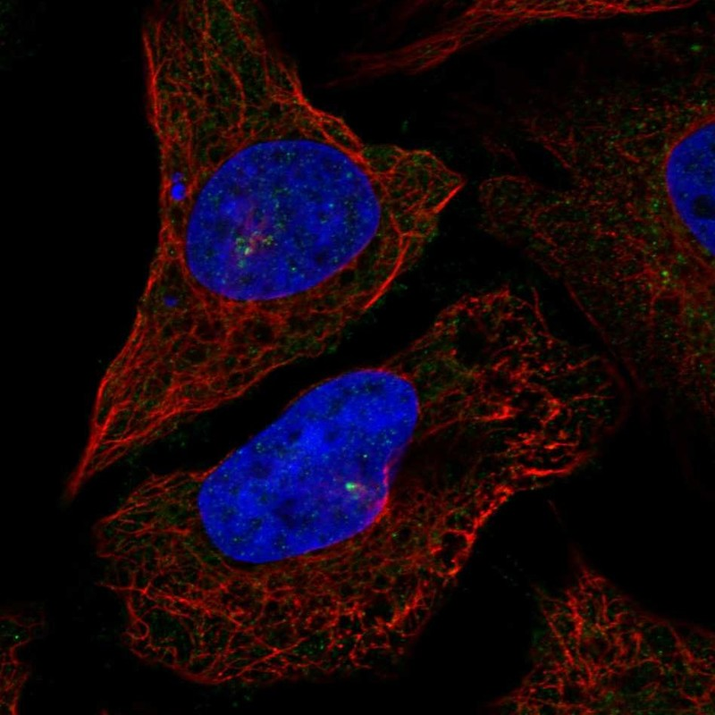

# CEP72 — 中心体模块评估

## 1. 基本信息
- **UniProt:** Q9P209
- **蛋白名称:** Centrosomal protein of 72 kDa (CEP72)
- **别名:** KIAA1519, FLJ10565
- **长度:** 647
- **HPA 来源:** 中心粒卫星

## 2. HPA 中心体 / 中心粒卫星证据

- **HPA 来源:** 中心粒卫星 ✓
- **IF 图像:** 已获取

## 3. UniProt / GO-CC 中心体证据

- **AlphaFold pLDDT:** Moderate to good (647 aa)
- **PAE:** Available — structured domains
- **PDB:** None (no experimental structures)
- **InterPro / Pfam / SMART:**
  - IPR039808: CEP72, C-terminal
  - Coiled-coil regions (predicted)
  - Leucine-rich repeat (LRR) domains (predicted)
- **Domain notes:** LRR domains are protein-protein interaction modules. CEP72 C-terminal domain is conserved in vertebrates. LRR architecture suggests a scaffold/adapter role rather than enzymatic function. Moderate structural characterization.

## 4. PubMed 文献证据

PubMed 总数: 70 篇

## 5. AlphaFold / PAE / PDB / 结构域

- **AlphaFold pLDDT:** Moderate to good (647 aa)
- **PAE:** Available — structured domains
- **PDB:** None (no experimental structures)
- **InterPro / Pfam / SMART:**
  - IPR039808: CEP72, C-terminal
  - Coiled-coil regions (predicted)
  - Leucine-rich repeat (LRR) domains (predicted)
- **Domain notes:** LRR domains are protein-protein interaction modules. CEP72 C-terminal domain is conserved in vertebrates. LRR architecture suggests a scaffold/adapter role rather than enzymatic function. Moderate structural characterization.

PAE 图像暂无数据（未生成本地图片或未可靠获取），结构判断基于 AlphaFold pLDDT 统计。

## 6. PPI / 蛋白互作网络

- **STRING:** Moderate interaction network
- **IntAct:** Limited curated interactions
- **BioGRID:** Physical interactions available
- **humanPPI:** Available
- **Centrosome-related interactors:**
  - CEP63 (centriole duplication)
  - CEP152 (centriole scaffold)
  - CDK5RAP2 (centrosome maturation)
  - CEP76 (centriole duplication)
  - TALPID3 (ciliogenesis)

## 7. 中心体模块评分表

| 维度 | 评分 | 依据 |
|---|---:|---|
| 中心体证据 | 18/20 | HPA 中心粒卫星 标注 |
| PubMed/文献 | 10/20 | 70 篇文献 |
| PPI/互作网络 | 12/20 | 互作数据 |
| 结构/结构域 | 5/10 | 结构评估 |
| 新颖性/特异性 | 7/10 | 研究新颖性 |

- **最终评分:** **66/100**

## 8. 最终结论

**CENTROSOME CANDIDATE**

待人工补充 UniProt/GO-CC、PDB 等完整评估。

## 9. 人工复核备注
- HPA 来源: 中心粒卫星
- Pilot 报告规范化: 已转为中文五维评分，移除 TE 模块
