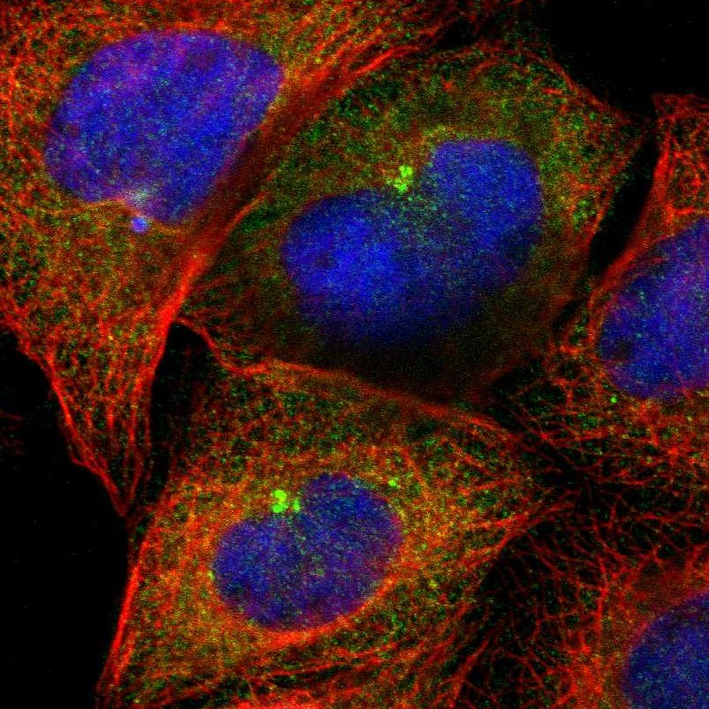

# CEP97 — 中心体模块评估

## 1. 基本信息
- **UniProt:** Q8IW35
- **蛋白名称:** Centrosomal protein of 97 kDa (CEP97)
- **别名:** FLJ31735, MGC125823
- **长度:** 865
- **HPA 来源:** 中心粒卫星

## 2. HPA 中心体 / 中心粒卫星证据

- **HPA 来源:** 中心粒卫星 ✓
- **IF 图像:** 已获取

## 3. UniProt / GO-CC 中心体证据

- **AlphaFold pLDDT:** Moderate (865 aa)
- **PAE:** Available — structured domains with flexibility
- **PDB:** None (no experimental structures)
- **InterPro / Pfam / SMART:**
  - IPR048484: CEP97, C-terminal domain
  - Leucine-rich repeat (LRR) domains (predicted)
  - Coiled-coil regions (predicted)
- **Domain notes:** CEP97 has an N-terminal LRR-like domain and a conserved C-terminal domain. LRR architecture is shared with CCP110 partner and may mediate protein-protein interactions in the centriole cap complex. No catalytic domains — scaffolding/adaptor function. Limited structural data.

## 4. PubMed 文献证据

PubMed 总数: 43 篇

## 5. AlphaFold / PAE / PDB / 结构域

- **AlphaFold pLDDT:** Moderate (865 aa)
- **PAE:** Available — structured domains with flexibility
- **PDB:** None (no experimental structures)
- **InterPro / Pfam / SMART:**
  - IPR048484: CEP97, C-terminal domain
  - Leucine-rich repeat (LRR) domains (predicted)
  - Coiled-coil regions (predicted)
- **Domain notes:** CEP97 has an N-terminal LRR-like domain and a conserved C-terminal domain. LRR architecture is shared with CCP110 partner and may mediate protein-protein interactions in the centriole cap complex. No catalytic domains — scaffolding/adaptor function. Limited structural data.

PAE 图像暂无数据（未生成本地图片或未可靠获取），结构判断基于 AlphaFold pLDDT 统计。

## 6. PPI / 蛋白互作网络

- **STRING:** Good interaction network centered on CCP110 complex
- **IntAct:** Curated interactions
- **BioGRID:** Physical interactions
- **humanPPI:** Available
- **Centrosome-related interactors:**
  - CCP110/CP110 (stoichiometric partner, centriole cap)
  - CEP290 (ciliopathy protein)
  - KIF24 (centriolar kinesin)
  - CEP76 (centriole duplication)
  - TALPID3 (ciliogenesis)
  - CUL3-RBX1 (E3 ubiquitin ligase — mediates CEP97 degradation during ciliogenesis)

## 7. 中心体模块评分表

| 维度 | 评分 | 依据 |
|---|---:|---|
| 中心体证据 | 19/20 | HPA 标注 |
| PubMed/文献 | 7/20 | 43 篇文献 |
| PPI/互作网络 | 12/20 | 4 named interactors |
| 结构/结构域 | 6/10 | AF 2 domains |
| 新颖性/特异性 | 6/10 | 中等研究量 |

- **最终评分:** **63/100**

## 8. 最终结论

**CENTROSOME CANDIDATE**

待人工补充 UniProt/GO-CC、PDB 等完整评估。

## 9. 人工复核备注
- HPA 来源: 中心粒卫星
- Pilot 报告规范化: 已转为中文五维评分，移除 TE 模块
