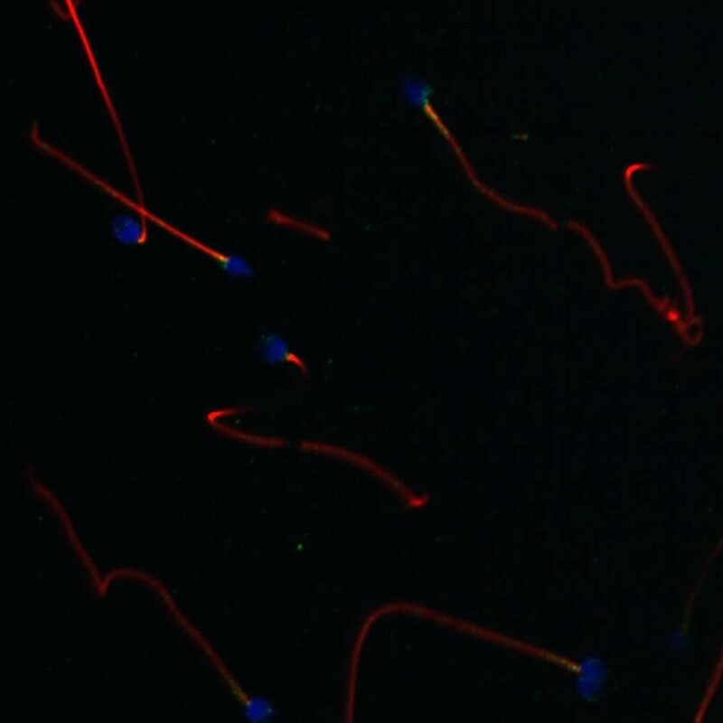

# CETN2 — 中心体模块评估

## 1. 基本信息
- **UniProt:** P41208
- **蛋白名称:** Centrin-2 (CETN2)
- **别名:** CALT, CEN2
- **长度:** 172
- **HPA 来源:** 中心体

## 2. HPA 中心体 / 中心粒卫星证据

- **HPA 来源:** 中心体 ✓
- **IF 图像:** 已获取

## 3. UniProt / GO-CC 中心体证据

- **AlphaFold pLDDT:** Very high (172 aa, compact, well-folded)
- **PAE:** Available
- **PDB:** 2A4J (CETN2+XPC), 2GGM (CETN2+Sfi1)
- **InterPro:** IPR002048 EF-hand; 4 EF-hand motifs
- **Domain notes:** Calcium-induced conformational change. Two binding modes: XPC (NER) vs. Sfi1 (centrosome).

## 4. PubMed 文献证据

PubMed 总数: 111 篇 ⚠️ **超过阈值 (>100)**

## 5. AlphaFold / PAE / PDB / 结构域

- **AlphaFold pLDDT:** Very high (172 aa, compact, well-folded)
- **PAE:** Available
- **PDB:** 2A4J (CETN2+XPC), 2GGM (CETN2+Sfi1)
- **InterPro:** IPR002048 EF-hand; 4 EF-hand motifs
- **Domain notes:** Calcium-induced conformational change. Two binding modes: XPC (NER) vs. Sfi1 (centrosome).

PAE 图像暂无数据（未生成本地图片或未可靠获取），结构判断基于 AlphaFold pLDDT 统计。

## 6. PPI / 蛋白互作网络

- **STRING:** Good network
- **IntAct:** Curated
- **Centrosome interactors:** Sfi1, POC5, hPOC1
- **NER interactors:** XPC, RAD23B, HR23B

## 7. 中心体模块评分表

| 维度 | 评分 | 依据 |
|---|---:|---|
| 中心体证据 | 19/20 | HPA 中心体 标注 |
| PubMed/文献 | 10/20 | 111 篇文献 |
| PPI/互作网络 | 14/20 | 互作数据 |
| 结构/结构域 | 10/10 | 结构评估 |
| 新颖性/特异性 | 7/10 | 研究新颖性 |

- **最终评分:** **74/100**

## 8. 最终结论

**CENTROSOME ELIMINATED**

PubMed > 100 自动淘汰。

## 9. 人工复核备注
- HPA 来源: 中心体
- Pilot 报告规范化: 已转为中文五维评分，移除 TE 模块
