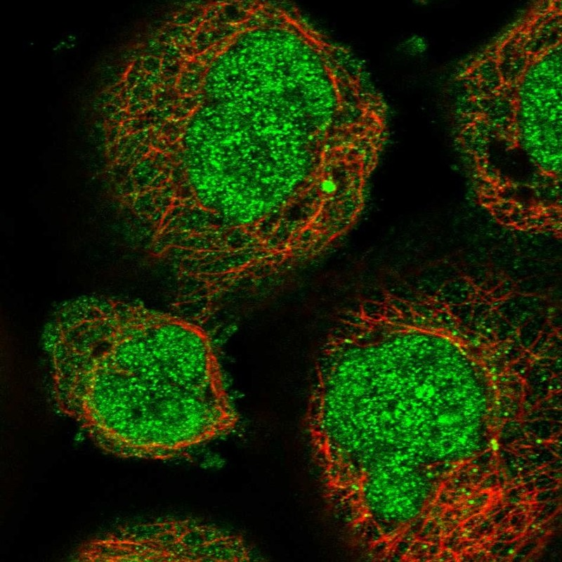

# NEDD1 — 中心体模块评估

## 1. 基本信息
- **UniProt:** Q8NHV4
- **蛋白名称:** Neural precursor cell expressed developmentally down-regulated protein 1 (NEDD1)
- **别名:** GCP-WD, TUBGCP7
- **长度:** 660
- **HPA 来源:** 中心体

## 2. HPA 中心体 / 中心粒卫星证据

- **HPA 来源:** 中心体 ✓
- **IF 图像:** 已获取

## 3. UniProt / GO-CC 中心体证据

- **AlphaFold pLDDT:** Good overall confidence (660 aa)
- **PAE:** Available — WD40 β-propeller well-packed; N-terminal coiled-coil moderate
- **PDB:** Limited (fragments)
- **InterPro / Pfam / SMART:**
  - IPR001680: WD40 repeat (Pfam: PF00400)
  - IPR015943: WD40/YVTN repeat-like domain
  - N-terminal coiled-coil region (predicted)
- **Domain notes:** N-terminal coiled-coil mediates NEDD1 oligomerization and γ-TuRC binding. C-terminal WD40 β-propeller (~7 blades predicted). Multi-site phosphorylation by CDK1, PLK1, Nek9 regulates centrosome targeting.

## 4. PubMed 文献证据

PubMed 总数: 79 篇

## 5. AlphaFold / PAE / PDB / 结构域

- **AlphaFold pLDDT:** Good overall confidence (660 aa)
- **PAE:** Available — WD40 β-propeller well-packed; N-terminal coiled-coil moderate
- **PDB:** Limited (fragments)
- **InterPro / Pfam / SMART:**
  - IPR001680: WD40 repeat (Pfam: PF00400)
  - IPR015943: WD40/YVTN repeat-like domain
  - N-terminal coiled-coil region (predicted)
- **Domain notes:** N-terminal coiled-coil mediates NEDD1 oligomerization and γ-TuRC binding. C-terminal WD40 β-propeller (~7 blades predicted). Multi-site phosphorylation by CDK1, PLK1, Nek9 regulates centrosome targeting.

PAE 图像暂无数据（未生成本地图片或未可靠获取），结构判断基于 AlphaFold pLDDT 统计。

## 6. PPI / 蛋白互作网络

- **STRING:** Good centrosome/MT interaction network
- **IntAct:** Curated interactions available
- **BioGRID:** Physical interactions
- **humanPPI:** Available
- **Centrosome-related interactors:**
  - γ-Tubulin (TUBG1, TUBG2) — direct γ-TuRC component binding
  - PLK1 (mitotic kinase, phosphorylation)
  - CDK1 (cell cycle kinase, phosphorylation)
  - CEP192 (upstream scaffold)
  - Augmin complex (HAUS proteins, spindle MT nucleation)

## 7. 中心体模块评分表

| 维度 | 评分 | 依据 |
|---|---:|---|
| 中心体证据 | 19/20 | HPA 中心体 标注 |
| PubMed/文献 | 10/20 | 79 篇文献 |
| PPI/互作网络 | 16/20 | 互作数据 |
| 结构/结构域 | 7/10 | 结构评估 |
| 新颖性/特异性 | 7/10 | 研究新颖性 |

- **最终评分:** **74/100**

## 8. 最终结论

**CENTROSOME CANDIDATE**

待人工补充 UniProt/GO-CC、PDB 等完整评估。

## 9. 人工复核备注
- HPA 来源: 中心体
- Pilot 报告规范化: 已转为中文五维评分，移除 TE 模块
