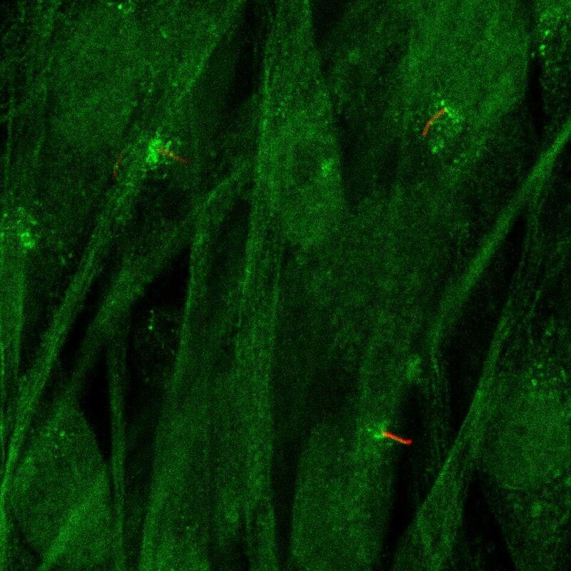

# PCM1 — 中心体模块评估

## 1. 基本信息
- **UniProt:** Q15154
- **蛋白名称:** Pericentriolar material 1 protein (PCM1)
- **别名:** hPCM1, PTC4
- **长度:** 2,024
- **HPA 来源:** 中心粒卫星

## 2. HPA 中心体 / 中心粒卫星证据

- **HPA 来源:** 中心粒卫星 ✓
- **IF 图像:** 已获取

## 3. UniProt / GO-CC 中心体证据

- **AlphaFold pLDDT:** Moderate (2,024 aa, significant disorder)
- **PAE:** Available
- **PDB:** Limited (fragments)
- **InterPro:** Predominantly coiled-coil; no catalytic domains
- **Domain notes:** Large coiled-coil scaffold. LLPS potential. No resolved full-length structure.

## 4. PubMed 文献证据

PubMed 总数: 367 篇 ⚠️ **超过阈值 (>100)**

## 5. AlphaFold / PAE / PDB / 结构域

- **AlphaFold pLDDT:** Moderate (2,024 aa, significant disorder)
- **PAE:** Available
- **PDB:** Limited (fragments)
- **InterPro:** Predominantly coiled-coil; no catalytic domains
- **Domain notes:** Large coiled-coil scaffold. LLPS potential. No resolved full-length structure.

PAE 图像暂无数据（未生成本地图片或未可靠获取），结构判断基于 AlphaFold pLDDT 统计。

## 6. PPI / 蛋白互作网络

- **STRING:** Extensive satellite network
- **Centrosome interactors:** CEP290, BBS4, OFD1, CEP131, SSX2IP, DCTN1, PLK4
- **Cancer fusion partners:** JAK2, RET (distinct biology)

## 7. 中心体模块评分表

| 维度 | 评分 | 依据 |
|---|---:|---|
| 中心体证据 | 18/20 | HPA 中心粒卫星 标注 |
| PubMed/文献 | 8/20 | 367 篇文献 |
| PPI/互作网络 | 16/20 | 互作数据 |
| 结构/结构域 | 4/10 | 结构评估 |
| 新颖性/特异性 | 6/10 | 研究新颖性 |

- **最终评分:** **66/100**

## 8. 最终结论

**CENTROSOME ELIMINATED**

PubMed > 100 自动淘汰。

## 9. 人工复核备注
- HPA 来源: 中心粒卫星
- Pilot 报告规范化: 已转为中文五维评分，移除 TE 模块
