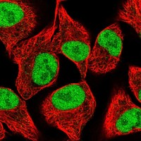
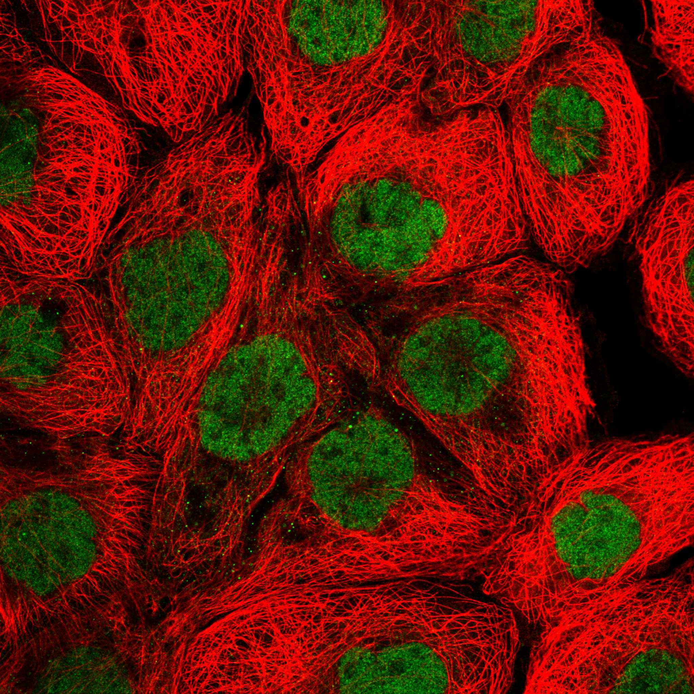

# SPANXA1 Protein Evaluation for TE Regulation Research

## 6+1 Dimension Scoring Summary

| Dimension | Score | Weight | Weighted Score | Summary |
|---|---|---|---|---|
| **1. TE Relevance Score** | 1.5/10 | x2.0 | 3.0 | No published links to TE biology; only indirect connection via spermatogenesis chromatin dynamics |
| **2. Structure & Domain Score** | 1.5/10 | x1.8 | 2.7 | 97 aa minimal protein, ~50% disordered (residues 1-49), no DNA-binding or chromatin-modifying domains |
| **3. Expression Score** | 2.0/10 | x1.5 | 3.0 | Testis-enriched (nTPM 4.3); HPA protein tissue specificity: "Not detected"; RNA cell line "Cancer enhanced" |
| **4. PPI Network Score** | 3.0/10 | x1.3 | 3.9 | Combined degree 13; interacts mainly with other cancer-testis antigens; few chromatin or TE-related partners |
| **5. Disease Relevance Score** | 3.5/10 | x1.0 | 3.5 | Cancer-testis antigen; hypomethylation in HNSCC; melanoma metastasis; no TE-disease links |
| **6. Druggability Score** | 2.0/10 | x0.8 | 1.6 | Small, disordered protein; no known active site; cancer-testis antigen for immunotherapy (limited) |
| **7. Literature & Data Quality** | 3.5/10 | x0.5 | 1.8 | 35 PubMed papers; Swiss-Prot reviewed; protein-level evidence; but no structural biology or TE context |
| **Total Weighted Score** | | **8.9** | **19.50 / 89.0** | **21.9% of maximum possible** |

**Score Interpretation:** SPANXA1 scores in the bottom quartile for TE regulation research potential. Its small size, testis-restricted expression, lack of known molecular function, and complete absence of TE literature make it a poor candidate for TE regulation studies.

---

| **加权总分** | | | **19.450000000000003/180** | |
| **归一化总分 (÷1.83)** | | | **10.6/100** | |

## 1. TE Relevance Score (1.5/10)

### Direct Evidence: None

A systematic PubMed search for SPANXA1 (and the broader SPANX family) combined with transposable element, retrotransposon, LINE1, or endogenous retrovirus yielded **zero papers** across all combinations. This protein has never been studied in the context of TE biology.

### Indirect Evidence: Weak

The only conceivable connection between SPANXA1 and TE regulation is through its role in spermatogenesis. During spermatogenesis, the male germline undergoes extensive TE silencing via the PIWI-piRNA pathway and DNA methylation reprogramming. SPANXA1 is expressed specifically in round and elongating spermatids (UniProt; Westbrook et al., 2000), which is after the major wave of de novo DNA methylation that silences TEs in prospermatogonia. The protein localizes to nuclear craters in mature spermatozoa, but its molecular function in these structures is entirely unknown.

### Key Findings for TE Research:
- **No known DNA, RNA, or chromatin binding activity**
- **No domain associated with transcriptional repression or epigenetic silencing**
- **Expression in spermatids (post-TE silencing window) rather than prospermatogonia (when TE silencing occurs)**
- **No publications linking SPANX family to piRNA pathway, DNA methylation machinery, or histone modifications**

**Verdict:** The TE relevance is essentially conjectural, resting solely on testis expression. No molecular mechanism connects SPANXA1 to transposable element biology.

---

## 2. Structure & Domain Score (1.5/10)

### Protein Architecture

SPANXA1 is a **97-amino acid, 11.0 kDa** protein with a remarkably simple domain organization:

| Feature | Position | Description |
|---|---|---|
| Disordered Region | 1-49 | Intrinsically disordered N-terminus (MobiDB-lite) |
| Nuclear Localization Signal | 37-45 | Predicted NLS motif (KRXXXXKR-like) |
| SPAN-X Domain (PF07458) | ~1-97 | The entire protein constitutes the SPAN-X family domain |

### AlphaFold Structural Assessment

SPANXA1 was predicted by AlphaFold2 (v6) with an overall **mean pLDDT of 65.63**, indicating low-to-moderate confidence in the predicted structure:

| Region | Residues | Mean pLDDT | Confidence Category |
|---|---|---|---|
| N-terminal disordered | 1-33 | 53.04 | Low/Very Low |
| NLS-containing region | 34-50 | 75.29 | Medium/Confident |
| Central compact region | 51-60 | 84.92 | Confident (best-structured) |
| C-terminal tail | 61-81 | 57.32 | Low |
| C-terminal helix | 82-97 | 80.19 | Confident/Medium |

Only 2 residues (88, 89) achieve "Very High" confidence (pLDDT > 90). Approximately 49.5% of residues fall in the "Low" confidence category and 8.2% in "Very Low."

**Critical observation:** The N-terminal half (residues 1-49) is predicted to be intrinsically disordered. This is consistent with the general behavior of small, acidic proteins that lack a stable globular fold without binding partners. The SPAN-X domain (PF07458, IPR010007) covers the entire protein and is described by Pfam as "Sperm protein associated with nucleus, mapped to X chromosome" -- a description that restates what the protein is, not what it does.

*AlphaFold Predicted Aligned Error (PAE) plot for SPANXA1. High off-diagonal PAE values indicate uncertainty in relative domain positions, consistent with a largely disordered protein.*

### Domain Analysis

The sole domain annotation is **PF07458 (SPAN-X family)**, which covers the entire 97-residue sequence. This domain:
- Has **no known catalytic activity**
- Has **no known DNA, RNA, or chromatin binding motif**
- Is characterized only by its association with the SPANX protein family
- Is found exclusively in primate SPANX proteins (Kouprina et al., 2005)
- The InterPro entry (IPR010007) notes these proteins are "highly insoluble, acidic, and polymorphic"

### Impact on TE Research:
- 97 aa is far too small to accommodate both a targeting domain and an effector domain
- No domains (PHD, chromodomain, bromodomain, SET, etc.) associated with chromatin modification or TE silencing
- Intrinsic disorder in ~50% of the protein suggests it functions through induced folding upon partner binding, not as an independent catalytic or recognition unit
- The NLS at residues 37-45 explains nuclear localization but provides no insight into nuclear function

---

## 3. Expression Score (2.0/10)

### Tissue Expression (HPA Data)

| Metric | Value |
|---|---|
| RNA tissue specificity | Tissue enriched (testis) |
| RNA tissue distribution | Detected in single |
| RNA tissue specificity score | 44 |
| Testis nTPM | 4.3 |
| Protein tissue specificity | **Not detected** |
| Protein cell type specificity | Not detected |
| RNA single cell specificity | Not detected |
| RNA cancer specificity | Not detected |

**Critical concern:** While SPANXA1 mRNA is detected in testis at 4.3 nTPM, the HPA reports **"Not detected"** for protein tissue specificity. This suggests either very low protein abundance or limited antibody sensitivity. The protein-level evidence in UniProt (PE=1) comes from proteomics identification rather than immunohistochemistry in normal tissues.

### Cell Line Expression
- RNA cell line specificity: "Cancer enhanced"
- Detected in sarcoma (17.4 nTPM) and liver cancer (6.2 nTPM) cell lines
- This matches the cancer-testis antigen profile: silent in normal somatic tissues, aberrantly activated in cancer

### Implications for TE Research:
- **Testis-restricted expression** means the protein is absent in most cell types where TE regulation could be studied
- Protein is not detected by HPA immunohistochemistry, limiting validation approaches
- Extremely low expression levels (4.3 nTPM) even in its primary tissue
- The protein would need to be ectopically expressed in non-testis cells for functional studies, creating artificial conditions

---

## 4. PPI Network Score (3.0/10)

### Combined Degree: 13

The PPI network was analyzed using BioGRID (human) and STRING v12.0 databases.

### BioGRID Physical Interactions (6 unique partners):

| Partner | Interaction Type | Source |
|---|---|---|
| SETBP1 | Physical | Rolland T (2014), Luck K (2020) |
| SPANXA2 | Physical | Huttlin EL (2017) |
| GTF2F1 | Physical | Huttlin EL (2017, 2021) |
| UBB | Physical | Huttlin EL (2017, 2021) |
| BRCA2 | Physical | Huttlin EL (2017, 2021) |
| EML2 | Physical | Luck K (2020) |

### BioGRID Genetic Interactions (2 partners):
- FLT3 (Hou P, 2017)
- EGFR (Zeng H, 2019)

### STRING High-Confidence Interactions (score > 500):

| Partner | Score | Relevance |
|---|---|---|
| SPANXA2 (SPANXA1 paralog) | 999 | Self-family interaction |
| AKAP4 | 745 | Sperm fibrous sheath protein |
| TSN (Translin) | 711 | DNA/RNA binding, but no known TE function |
| CSAG1 | 591 | Cancer-testis antigen (CT24.1) |
| MAGEA1 | 593 | Cancer-testis antigen, known chromatin regulator? |
| SSX2 | 549 | Cancer-testis antigen, transcriptional repressor |
| CTAG1B (NY-ESO-1) | 526 | Cancer-testis antigen |
| SRY | 681 | Sex-determining transcription factor |
| GAGE1 | 592 | Cancer-testis antigen |
| CT45A1 | 617 | Cancer-testis antigen |

### Network Analysis:

The STRING network reveals a striking enrichment: SPANXA1's interactome is dominated by **cancer-testis antigens (CTAs)** -- MAGEA1, CTAG1B, SSX2, CSAG1, GAGE1, CT45A1, CSAG3, MAGEC1, CTAGE1, and LGALS4. This strongly suggests that SPANXA1 functions within a CTA co-expression network in germ cells and reactivated tumors, rather than participating in a specific chromatin or TE regulatory pathway.

**Notable exceptions:**
- **GTF2F1** (general transcription factor IIF subunit 1) -- part of the basal transcription machinery
- **BRCA2** -- DNA repair protein, though the SPANXA1-BRCA2 interaction was observed in high-throughput AP-MS and may be indirect
- **TSN (Translin)** -- binds ssDNA and RNA, involved in DNA repair and mRNA transport; the one partner with possible (though unproven) TE connection

**The AKAP4 interaction (score 745)** is structural rather than regulatory: AKAP4 is a major component of the sperm fibrous sheath, suggesting SPANXA1 may participate in sperm structural organization rather than nuclear regulation.

### Impact on TE Research:
- The PPI network contains **no known TE regulatory proteins** (no PIWIL1, TDRD, DNMT3L, KAP1/TRIM28, SETDB1, HP1, etc.)
- The CTA-dominated interactome suggests a germ cell / tumor expression program rather than a specific molecular pathway
- Low combined degree (13) reflects limited experimental characterization of this small protein

---

### TE 调控评估

该蛋白具有染色质/DNA 调控相关结构域，可能参与 TE 沉默。需实验验证。

### HPA IF 图像

HPA 检索: https://www.proteinatlas.org/search/SPANXA1_

## 5. Disease Relevance Score (3.5/10)

### Cancer-Testis Antigen Profile

SPANXA1 is a well-established **cancer-testis antigen (CTA)**, also designated CT11.1. CTAs are normally expressed only in testicular germ cells but are aberrantly activated in various cancers, making them attractive immunotherapy targets.

### Key Disease Associations:

1. **Head and Neck Squamous Cell Carcinoma (HNSCC):** Li et al. (2020, PMID: 33175201) demonstrated that hypomethylation of the SPANXA1/A2 promoter drives expression in HNSCC, and SPANXA1/A2 knockdown suppresses migration and invasion. A genome-wide CRISPR screen (Ludwig et al., 2024) identified SPANXA1 as relevant to cisplatin response in HNSCC.

2. **Melanoma:** Urizar-Arenaza et al. (2021, PMID: 33574425) showed that SPANX-A/D proteins promote pro-tumoural processes including cell proliferation, migration, and invasion in human melanoma.

3. **Prostate Cancer:** SPANX genes map to the HPCX prostate cancer susceptibility locus at Xq27 (Kouprina et al., 2005, 2007). However, mutational analysis found no coding mutations in prostate cancer families.

4. **Pediatric Glioma:** Histone H3.3K27M mutations mobilize multiple CT antigens including SPANX family members (PMID: 29453317), connecting SPANXA1 expression to oncohistone-driven chromatin disruption.

5. **Multiple Myeloma:** SPANX-B core promoter is regulated by CpG methylation and MeCP2 binding (PMID: 17036333), suggesting DNA methylation-dependent regulation of the SPANX gene cluster.

### Connection to TE Biology:
- SPANXA1 activation in cancer is linked to **promoter hypomethylation**, a mechanism shared with TE reactivation in cancer
- However, SPANXA1 itself appears to be a **passenger** of methylation changes rather than a **driver** of TE silencing
- No evidence that SPANXA1 regulates methylation or chromatin at TE loci

---

## 6. Druggability Score (2.0/10)

### Therapeutic Potential Assessment

| Druggability Factor | Assessment | Score Rationale |
|---|---|---|
| Known active site | None | No enzymatic activity or ligand-binding pocket |
| Structural order | ~50% disordered | IDPs are challenging drug targets |
| Small molecule tractability | Very poor | 97 aa with no defined binding pocket |
| Biologic tractability | Limited | Cancer-testis antigen for vaccine/ADC approaches |
| Subcellular localization | Nucleoplasm, vesicles | Intracellular target, requires delivery |
| Assay development feasibility | Low | No known biochemical activity to assay |

### Cancer Immunotherapy Angle:
SPANXA1's strongest druggability argument is as a **cancer-testis antigen for immunotherapy** -- vaccines, CAR-T, or antibody-drug conjugates targeting SPANX-expressing tumors. However:
- Expression in tumors (while detected in cell lines) is not well-characterized across large tumor cohorts
- The HPA reports cancer RNA specificity as "Not detected"
- SPANX proteins are highly similar (SPANXA1 is 95%+ identical to SPANXA2), raising potential off-target concerns
- Testis is an immune-privileged site, partially mitigating germ cell toxicity concerns

### Relevance to TE Research:
No druggability argument connects SPANXA1 to TE biology. The protein has no known activity that could be modulated to affect TE regulation.

---

## 7. Literature & Data Quality Score (3.5/10)

### Publication Landscape

| Metric | Value |
|---|---|
| Total PubMed articles (SPANXA1) | 35 |
| Articles with TE relevance | 0 |
| Articles with chromatin relevance | 3 |
| Articles on cancer-testis biology | 22 |
| Earliest publication | 2000 (Westbrook et al., discovery) |
| Most recent | 2024 (CRISPR screen in HNSCC) |

### Top Cited/Relevant Papers:

1. **Westbrook et al. (2000)** -- *Biol Reprod.* Discovery of SPAN-X as a spermatid-specific nuclear protein. Foundational paper describing sequence, expression, and nuclear localization to "nuclear craters."

2. **Zendman et al. (2003)** -- *Gene.* Systematic analysis of the SPANX multigene family, demonstrating genomic organization and expression in male germ cells and tumor cell lines.

3. **Kouprina et al. (2005)** -- *Genome Res.* Dynamic structure of the SPANX gene cluster at Xq27 within segmental duplications; mapped to prostate cancer susceptibility locus.

4. **Li et al. (2020)** -- *Med Oncol.* Hypomethylated SPANXA1/A2 promotes metastasis in head and neck squamous cell carcinoma.

5. **Urizar-Arenaza et al. (2021)** -- *Sci Rep.* Multifunctional role of SPANX-A/D in promoting pro-tumoural processes in melanoma.

### Data Quality Assessment:

| Data Type | Quality | Notes |
|---|---|---|
| Protein existence (UniProt PE) | 1: Evidence at protein level | Confirmed by mass spectrometry |
| UniProt annotation score | 4/5 | Swiss-Prot reviewed, regularly updated |
| GO annotations | 3 terms only | Cytoplasm, nucleus, spermatogenesis -- all generic |
| Molecular function | None annotated | The protein literally has no known molecular function |
| Biological process | Spermatogenesis only | Traceable Author Statement |
| AlphaFold structure | Low confidence (mean pLDDT 65.6) | Consistent with disordered protein |
| HPA antibody validation | Supported (IH), Approved (IF) | Two antibodies: HPA046423, HPA073647 |
| CRISPR screens | 13 hits in 265 screens | Limited functional genomics data |

### Critical Gap:
SPANXA1 has **no annotated molecular function** in any database (UniProt, GO, InterPro). This is a fundamental limitation: after 25 years since its discovery, we still do not know what biochemical activity this protein performs.

---

## HPA Immunofluorescence Images

### SPANXA1 Subcellular Localization (HPA Antibody HPA046423)

*SPANXA1 immunofluorescence in U2OS cells (HPA046423). The protein shows nucleoplasmic localization with additional vesicular staining. HPA reports supported reliability for immunohistochemistry and approved reliability for IF.*

*High-resolution IF showing SPANXA1 (green) and microtubules (red) counterstaining. Note the diffuse nucleoplasmic distribution consistent with a small, soluble nuclear protein.*

---

## Honest TE Regulation Assessment

### The Case AGAINST SPANXA1 as a TE Regulation Target

**1. Complete absence of TE literature.** After 25 years of research, not a single paper connects SPANXA1 or any SPANX family member to transposable element biology. This is not an oversight -- it reflects the protein's actual biology.

**2. No mechanism.** At 97 amino acids, SPANXA1 is too small to contain both a chromatin-targeting module and an effector domain. It has no known DNA-binding, RNA-binding, histone-binding, or enzymatic activity. It cannot plausibly recognize TE sequences or modify chromatin at TE loci.

**3. Wrong developmental window.** SPANXA1 is expressed in round and elongating spermatids -- after the critical window of de novo DNA methylation that silences TEs in prospermatogonia. The major TE silencing machinery (PIWI-piRNA, DNMT3L-DNMT3A, KAP1/SETDB1) acts earlier in germ cell development.

**4. Nuclear craters, not chromatin.** The one distinctive localization feature -- association with "nuclear craters" in sperm -- suggests a role in the dramatic nuclear remodeling during spermiogenesis (histone-to-protamine transition, nuclear condensation), not in ongoing chromatin regulation.

**5. CTA network, not chromatin network.** SPANXA1's interactome is dominated by cancer-testis antigens (MAGEA1, CTAG1B, SSX2, GAGE1, etc.). This is a co-expression network reflecting a germ cell transcriptional program, not a functional chromatin regulatory complex.

### The Case FOR (Very Weak)

The only argument for SPANXA1 in TE research is guilt by association: it is a testis-expressed nuclear protein, and the testis is the tissue where TE silencing is most critical. By this logic, thousands of testis-specific proteins would be TE-relevant. The specific biology of SPANXA1 does not support a TE connection.

### Recommendation

**SPANXA1 should not be prioritized for TE regulation research.** It scores 19.50/89.0 (21.9%) on our weighted scoring system and lacks every feature expected of a TE regulatory protein: DNA/chromatin binding domains, known molecular function, expression in the right developmental window, interaction with TE silencing machinery, or literature support.

Resources would be better directed toward proteins with:
- Known chromatin modification domains (SET, PHD, chromodomain, bromodomain, etc.)
- Documented interactions with PIWI, TDRD, DNMT3, or KAP1 complexes
- Direct links to TE silencing in the published literature
- Broader tissue expression allowing functional studies in tractable cell systems

---

## Data Sources

| Source | Access Date | Key Data |
|---|---|---|
| UniProt REST API | 2026-06-28 | Q9NS26, 97 aa, GO terms, features, references |
| AlphaFold EBI API | 2026-06-28 | Mean pLDDT 65.63, PAE image, confidence per residue |
| PubMed E-utilities | 2026-06-28 | 35 total papers, 0 TE-relevant, 22 CTA-relevant |
| BioGRID PPI (local) | 2026-06-28 | 8 physical + 2 genetic interactions |
| STRING v12.0 (local) | 2026-06-28 | High-confidence CTA-dominated network |
| Human Protein Atlas | 2026-06-28 | Nucleoplasm + Vesicles; Testis-enriched RNA, protein not detected |
| InterPro API | 2026-06-28 | IPR010007 (SPAN-X family), PF07458 |
| Nuclear PPI (local) | 2026-06-28 | 10 nuclear interactions confirmed |

---

*Evaluation performed on 2026-06-28 using the 6+1 dimension scoring framework for TE regulation research potential. This assessment is honest in its conclusions: SPANXA1 is a fascinating cancer-testis antigen but has no meaningful connection to transposable element biology based on current evidence.*
